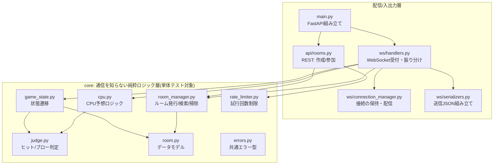
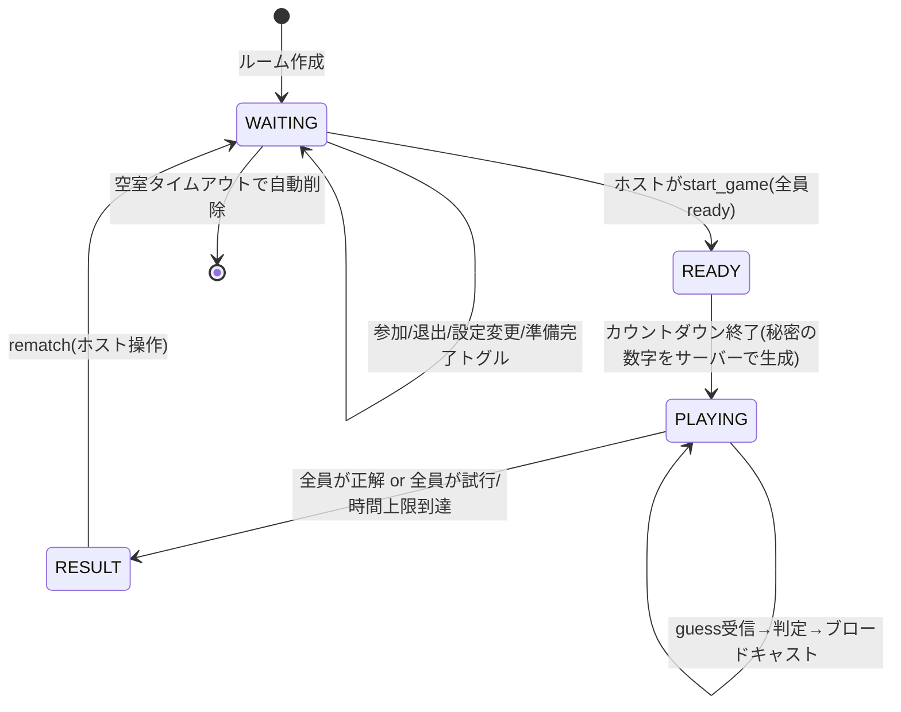

# コードレース

ヒット&ブロー形式の数字当てを、複数人でリアルタイム対戦(レースモード)、
または CPU 相手にひとりで練習(ソロモード)できる Web アプリです。

秘密の数字(3〜5桁、重複可否も選択可)を、**ヒット**(数字も位置も一致)と
**ブロー**(数字のみ一致)のヒントをもとに当てます。レースモードでは同じ問題を
全員が同時に解き、少ない回数・短い時間で正解した人が勝ちです。

> 有名なパズルゲームやその商標とは無関係の、オリジナルの名称・デザインです。

---

## 目次

- [デモの動かし方](#デモの動かし方)
- [主な機能](#主な機能)
- [技術スタック](#技術スタック)
- [アーキテクチャ](#アーキテクチャ)
- [ディレクトリ構成](#ディレクトリ構成)
- [WebSocket メッセージ仕様](#websocket-メッセージ仕様)
- [状態遷移](#状態遷移)
- [設計判断メモ](#設計判断メモ)
- [セキュリティ対策](#セキュリティ対策)
- [テスト](#テスト)
- [今後の改善点](#今後の改善点)
- [AI活用について](#ai活用について)
- [サードパーティライセンス](#サードパーティライセンス)

---

## デモの動かし方

### Docker(推奨・1コマンド)

```bash
docker build -t code-race .
docker run --rm -p 8000:8000 code-race
```

または:

```bash
docker compose up --build
```

起動後 `http://localhost:8000` にアクセスしてください。フロントエンドとAPI・
WebSocketを同一の FastAPI プロセスから配信しているため、これ以外の起動作業は
不要です。

### ローカル環境(Python 3.11+)

```bash
cd backend
python -m venv .venv
source .venv/Scripts/activate   # Windows(Git Bash) / macOS・Linuxは .venv/bin/activate
pip install -r requirements.txt
uvicorn app.main:app --reload
```

`http://localhost:8000` にアクセスします。

### スクリーンショット

<!--
  実際にプレイした画面のスクリーンショットをここに追加してください。
  例:
  
  
  
  
-->

| トップ | ロビー | 対戦中 | 結果 |
| --- | --- | --- | --- |
| (画像を追加) | (画像を追加) | (画像を追加) | (画像を追加) |

---

## 主な機能

- **レースモード**: 同じ秘密の数字を全員が同時に解き、回数の少なさ→タイムの
  速さでランキングを決める。
- **ソロモード**: トップページの「ひとりで遊ぶ」から、CPUを対戦相手にした
  練習用ルームをワンクリックで作成(ホストは自動的に準備完了状態になる)。
- **ルーム機能**: 6桁のルームコード発行(`secrets`モジュール、`0/O/1/I`など
  紛らわしい文字は除外)、コード入力または `/room/<コード>` のURL・QRコードで
  参加可能。ロビーには参加者一覧・準備完了ボタン・ホスト専用の設定変更/開始
  操作がある。
- **CPU参加**: 空き席にCPUを追加可能。難易度は3段階
  (弱=ランダム、普通=ヒントと矛盾しない候補からランダム、
  強=候補を効率よく絞り込むminimax近似)。
- **柔軟な設定**: 桁数(3〜5)、重複可否、回数制限、制限時間を部屋ごとに設定可能。
- **回答履歴**: 各プレイヤーの予想とヒット/ブロー結果をリアルタイムに表示
  (他プレイヤーの予想した数字そのものは非公開)。
- **切断・再接続**: ネットワーク瞬断時は自動再接続、タブを閉じた場合も
  ページ再読み込みで対戦状況を復元。

---

## 技術スタック

| 分類 | 技術 |
| --- | --- |
| バックエンド | Python 3.11+ / FastAPI / WebSocket(Starlette) |
| フロントエンド | 素のHTML / CSS / JavaScript(ESモジュール、フレームワークなし) |
| データ管理 | メモリ上の辞書(`RoomManager`)。永続化への差し替えを見据えて分離 |
| テスト | pytest / pytest-asyncio / FastAPI TestClient |
| 実行環境 | Docker(単一イメージでフロント・バックエンドを配信) |

---

## アーキテクチャ



**なぜこう分けたか**: `core/` はFastAPIやWebSocketを一切importしない。
判定・状態遷移・CPUロジック・レート制限を「通信の外側」に置くことで、
実際にサーバーを起動しなくても pytest だけで全ロジックを検証できる。
`ws/` 側は「core層を呼び、結果を配信する」薄い橋渡しに徹する。

---

## ディレクトリ構成

```
.
├── Dockerfile
├── docker-compose.yml
├── backend/
│   ├── requirements.txt
│   ├── pytest.ini
│   ├── app/
│   │   ├── main.py              # FastAPI組み立て、静的ファイル配信
│   │   ├── config.py            # タイマー等の定数
│   │   ├── core/                # 通信を知らない純粋ロジック層
│   │   │   ├── judge.py         # ヒット/ブロー判定・入力バリデーション
│   │   │   ├── game_state.py    # 状態遷移(WAITING→READY→PLAYING→RESULT)
│   │   │   ├── room.py          # Room/Playerなどのデータモデル
│   │   │   ├── room_manager.py  # ルームコード発行・検索・空室自動削除
│   │   │   ├── cpu.py           # CPU予想ロジック(弱/普通/強)
│   │   │   ├── rate_limiter.py  # IPごとの試行回数制限
│   │   │   └── errors.py        # 共通エラー型(GameError)
│   │   ├── schemas/
│   │   │   ├── messages.py      # WebSocketメッセージのPydanticモデル
│   │   │   └── rest.py          # REST API のリクエスト/レスポンス型
│   │   ├── api/
│   │   │   └── rooms.py         # ルーム作成・参加のREST API
│   │   └── ws/
│   │       ├── connection_manager.py  # 接続の保持・配信のみ担当
│   │       ├── serializers.py         # core層→送信用JSON変換
│   │       └── handlers.py            # メッセージ受付・振り分け・タイマー
│   └── tests/                   # pytest(core層+WebSocket結合テスト)
└── frontend/                    # 素のHTML/CSS/JS(フレームワークなし)
    ├── index.html                # トップ(作成/ひとりで遊ぶ/参加)
    ├── room.html                 # ロビー〜対戦〜結果(1ページで画面切替)
    ├── css/style.css
    └── js/
        ├── api.js                # REST呼び出し
        ├── ws.js                 # WebSocket接続(認証・自動再接続)
        ├── session.js            # player_id/tokenの保存(sessionStorage)
        ├── dom.js                # DOM生成・トースト表示の共通ヘルパー
        ├── qrcode.js              # vendorのQRライブラリの薄いラッパー
        ├── top.js / room.js       # 各ページのエントリーポイント
        ├── lobby.js / game.js     # ロビー画面 / 対戦・結果画面の描画
        └── vendor/qrcode-generator.js  # MITライセンスのQR生成ライブラリ
```

---

## WebSocket メッセージ仕様

エンベロープ形式 `{ "type": "...", "payload": {...} }` に統一している。
認証は接続直後の最初のメッセージとして送らせ、**トークンをURLには含めない**
(理由は[設計判断メモ](#設計判断メモ)を参照)。

### クライアント → サーバー

| type | payload | 説明 |
| --- | --- | --- |
| `auth` | `{ player_id, token }` | 接続直後、最初に必ず送る |
| `ready` | `{ is_ready }` | 準備完了トグル |
| `update_settings` | `{ digits, allow_duplicate, max_attempts, time_limit_sec, mode }` | ホストのみ、WAITING中のみ |
| `add_cpu` | `{ difficulty }` | CPU追加(ホストのみ) |
| `remove_cpu` | `{ player_id }` | CPU削除(ホストのみ) |
| `start_game` | `{}` | 開始(ホストのみ、全員準備完了で有効) |
| `guess` | `{ numbers }` | 予想を送信 |
| `leave` | `{}` | 明示的退出 |
| `rematch` | `{}` | 結果画面から再戦(ホストのみ) |

### サーバー → クライアント

| type | payload概要 | 説明 |
| --- | --- | --- |
| `room_state` | `phase, host_id, settings, players[]` | ロビー状態。変更のたびに全員へ再送 |
| `game_started` | `phase, started_at, settings` | 開始通知(秘密の数字は含まない) |
| `guess_result` | `player_id, attempt_no, hit, blow, (numbers)` | 本人には`numbers`込み、他人には非公開 |
| `game_result` | `secret_number, rankings[]` | 終了後に正解を公開 |
| `game_snapshot` | `phase, settings, history, (started_at), (secret_number, rankings)` | 再接続時に対戦状況をまとめて復元 |
| `error` | `code, message` | 個別クライアントへのみ送信 |

`game_snapshot` は当初の設計になく、[再接続対応](#設計判断メモ)の実装時に
追加した。

---

## 状態遷移



---

## 設計判断メモ

開発を進める中で判断した主なポイントと、その理由をまとめる。

### なぜWebSocketか

レースモードは「誰が何手目で正解したか」を全員にリアルタイムで見せる必要がある。
HTTPポーリングでも実現はできるが、対戦人数分のポーリングが常時発生し
サーバー負荷とレイテンシの両面で不利になる。WebSocketなら1接続を維持して
サーバー側から能動的にブロードキャストできるため、この用途に自然に合う。

### なぜ判定を必ずサーバー側で行うか

クライアントに秘密の数字を渡さない設計にしないと、ブラウザの開発者ツールで
簡単にチートできてしまう。`core/judge.py`での判定はサーバー側だけで行い、
`ws/serializers.py`は「`game_result`以外では`secret_number`を絶対含めない」
「本人以外には予想した`numbers`を含めない」という制約を1箇所に集約している。

### core層とws層を分離した理由

`core/`はFastAPI・WebSocketを一切importしない純粋なPythonロジックにした。
判定ロジック(`judge.py`)、状態遷移(`game_state.py`)、CPU思考(`cpu.py`)を
通信から独立させることで、実サーバーを起動せずpytestだけで全パターンを
検証できる。`ws/handlers.py`は「メッセージを受けてcore層を呼び、結果を
配信する」薄い橋渡しに徹しており、通信部分の変更(例: WebSocket以外の
プロトコルへの差し替え)がロジックに影響しない。

### エラーを`GameError`一種類に統一した理由

「この操作は今の状態/権限で許されるか」の失敗を、`code`と`message`を持つ
共通例外`GameError`で表現した。`ws/handlers.py`側は`try/except GameError`
一箇所で全操作のエラーをハンドリングでき、フロント側もエラーメッセージを
そのままトースト表示するだけで済む。

### 時刻を引数として受け取る設計(`now: datetime`)にした理由

カウントダウンや制限時間切れの判定を「関数が自分で`datetime.now()`を読む」
設計にすると、テストがタイミング依存になり不安定になる。`game_state.py`の
全関数は`now`を引数で受け取る純粋関数にし、実際の壁時計は`ws/handlers.py`の
asyncioタイマーだけが持つ。おかげでテストは`NOW + timedelta(seconds=3)`の
ように任意の時刻を注入するだけで、制限時間切れやカウントダウン終了の
境界を安定して再現できる。

### `room_state`を差分ではなく毎回全体スナップショットで配信する理由

参加・退出・CPU増減・準備完了トグルなど変化点が多く、差分配信は
サーバー・クライアント間の状態のズレ(同期バグ)を生みやすい。
「変化のたびに全体を送って画面を作り直す」方式にすることで実装がシンプルになり、
デバッグもしやすくなる。

### `guess_result`を受信者ごとに異なるpayloadで送る理由

レースモードでは「他の人が何手目で・何ヒット何ブローだったか」は全員に
見せたいが、予想した数字そのものが見えると次に自分が何を予想すべきかの
ヒントになってしまう。`connection_manager.py`に「宛先ごとに異なるメッセージを
組み立てるコールバックを渡す」汎用メソッド(`broadcast_personalized`)を
用意し、本人用/他人用のシリアライズ関数を分離した。

### 認証トークンをURLに含めない理由

WebSocketの接続URL自体はリバースプロキシのアクセスログやブラウザ履歴に
残ることがある。そのため`ws://.../ws/{room_code}`にはトークンを含めず、
接続直後の最初のメッセージとして`{"type":"auth", ...}`を送らせる設計にした。
WSメッセージ本文は通常のHTTPアクセスログの対象にならないため、ログ残留の
リスクを減らせる。ただし開発者が`console.log`などで意図せず出力すれば
漏れうるという限界はあり、`RoomManager`内部でもトークンは`Room`本体とは
別の辞書に保持し、`room_state`など通常の配信に誤って混ざらないようにしている。

### CPUの「強」をKnuthのminimax法の**サンプリング近似**にした理由

理論的に最適な一手は、打ったときに残る候補の最悪ケース数が最小になる手
(Knuthのminimax法)。しかし候補数は桁数5・重複ありの設定で最大10万通りに
なり、全候補×全候補を評価すると計算量が候補数の2乗になって現実的な時間で
終わらない。そこで評価対象・次の一手候補それぞれを最大200〜300件に
サンプリングして近似する設計にした。「常に最適」ではなく「統計的に普通より
効率が良い」ことをテスト(`test_hard_is_not_slower_than_normal_on_average`)
で確認している。

### CPUが同じ予想を繰り返さない仕組み

「候補が本当の秘密の数字だったなら、過去の全予想に対して記録通りの
ヒット/ブローになるはず」という条件だけで候補を絞り込んでいる。外れた
過去の予想自体を候補として検証すると「全ヒット」という記録と矛盾するため、
専用のロジックなしに自動的に除外される。実装中に気づいた副作用。

### 再接続を「自動再接続」と「セッション復元」の2段構えにした理由

ネットワークの瞬断は`ws.js`が指数バックオフで自動的に再接続する
(最大5回)。一方、タブを閉じた・PCがスリープしたなど自動再接続の猶予を
超えるケースは、`sessionStorage`に保存した`player_id`/`token`により
ページの再読み込みだけで復帰できるようにした。`localStorage`ではなく
`sessionStorage`を使うのは、同じ端末の別タブで別人が誤って同じセッションを
使ってしまう事故を防ぐため。再接続時は`room_state`だけでは分からない
「対戦中の詳細」を`game_snapshot`で追加送信し、フロント側で画面を
その場で組み立て直す。

### レート制限の対象をルームコード関連の2エンドポイントに絞った理由

ルームコードは6文字の英数字(紛らわしい文字を除いた32種)で組み合わせは
32^6 ≈ 10億通りあり、それ自体が現実的な時間での総当たりを困難にしている。
このレート制限はそれに加えて、同一IPからのスキャン的な挙動を早期に遮断する
多層防御として、コードを当てにいく形の`GET /api/rooms/{code}`と
`POST /api/rooms/{code}/join`にのみ適用した。無関係な`POST /api/rooms`
(新規作成)は対象外にしている。

### 実装中に見つけて直したバグ

- `Player.connected`の初期値が`True`になっており、REST参加直後(まだ
  WebSocket未接続)でも「接続中」と表示されてしまっていた。デフォルトを
  `False`に修正し、`ws/handlers.py`が実際に接続を確立した時点で`True`に
  変更した。
- `add_cpu`にホスト権限チェックが漏れており、非ホストでもCPUを追加できて
  しまっていた(`remove_cpu`にはチェックがあったが非対称だった)。
  ステップ1で決めたメッセージ仕様(「ホストのみ」)通りに修正した。
- 複数プレイヤー(人間+CPU)がほぼ同時に最後の一手を打つと、片方が結果を
  確定させた直後にもう片方が「既に終わっているのに終了処理をしようとする」
  レースが起こり得た。終了判定の競合を検知して無視するよう修正した。

どれもテストを書く過程、またはCPU自動対戦を実装して並行処理が現実的な
シナリオになった段階で見つかったもので、「テストや新機能追加が既存の
前提を検証し直すきっかけになる」実例として記録している。

---

## セキュリティ対策

- **入力バリデーション**: WebSocketメッセージ(Pydantic discriminated union)、
  REST リクエスト(Pydantic Field境界)、ゲームルール(`GameRules`)の3層で
  境界値を検証している。
- **XSS対策**: プレイヤー名などユーザー入力由来の文字列は、`frontend/js/dom.js`
  の`el()`ヘルパーを介して必ず`textContent`でDOMに設定し、`innerHTML`への
  文字列連結をアプリコードから排除している。
- **ルームコード総当たり対策**: `secrets`モジュールによる高エントロピーな
  コード発行に加え、`GET /api/rooms/{code}` と `POST /api/rooms/{code}/join`
  にIPベースのレート制限(既定20回/60秒)を適用。
- **判定はサーバー専有**: 秘密の数字はクライアントに一切送信しない
  (詳細は[設計判断メモ](#設計判断メモ)を参照)。
- **認証トークン**: 接続直後の最初のWebSocketメッセージでのみ送受信し、
  URLのクエリパラメータには含めない。

---

## テスト

```bash
cd backend
source .venv/Scripts/activate
pytest -v
```

- `core/`層(判定・状態遷移・ルーム管理・CPU・レート制限)の単体テスト
- FastAPI TestClientによるREST APIの結合テスト
- FastAPI TestClientのWebSocketセッションを使った結合テスト
  (レース進行、CPU自動対戦、権限エラー、再接続によるスナップショット復元 等)

アプリコード約1,700行に対してテストコードは約1,500行、121件全てパスする
状態を保っている。タイマー関連のテストは実際に`sleep`で待つ代わりに、
`datetime`を固定値で注入する、または`READY_COUNTDOWN_SEC`/CPUの手待ち時間を
`monkeypatch`で短縮することで、実行時間を伸ばさずに境界条件を再現している。

---

## 今後の改善点

- ルーム・ゲーム状態は現状メモリ管理。`RoomManager`のメソッドシグネチャは
  保ったまま、内部をRedisなどに差し替えられるよう意識して設計してある
  (呼び出し側は中身がメモリかDBかを意識しない)。
- `requirements.txt`にテスト用パッケージ(pytest等)も含めている。
  本番用に分離すればDockerイメージをさらに軽量化できる。
- CPUの「強」は候補数が多いときサンプリング近似にフォールバックする。
  候補集合をラウンドをまたいでキャッシュする、などの最適化余地がある。
- 現在は日本語UIのみ。文言を分離すれば多言語対応も可能な構成にはなっている。

---

## AI活用について

本プロジェクトは Claude Code を使い、設計から実装・テスト・動作確認まで
対話しながら段階的に進めた。具体的な使い方は以下の通り。

1. **設計フェーズ**: ディレクトリ構成、WebSocketメッセージ仕様、状態遷移図を
   先に提案してもらい、こちらの意図(ソロモードの扱い、認証方式、レート制限の
   要否など)をすり合わせてから実装に入った。
2. **段階的実装**: 「判定ロジック→ルーム管理→WebSocket通信→フロントエンド→
   CPU→切断/再接続→Docker/README」の順に1段階ずつ実装・テスト・報告してもらい、
   各段階の完了ごとに次に進むかを確認した。
3. **テスト駆動での検証**: 各機能追加後に必ずpytestを実行させ、失敗があれば
   その場で原因を確認・修正させた。Player.connectedの初期値バグや
   add_cpuの権限チェック漏れは、いずれもテストを書く過程で見つかっている。
4. **実機確認**: フロントエンドは実際にブラウザを操作させ(ルーム作成→
   CPU対戦→結果画面、ページリロードによる再接続復元など)、UIが実際に
   動くことをスクリーンショット付きで確認した。Dockerイメージも実際に
   ビルド・起動し、HTTP/WebSocket双方の疎通を確認している。
5. **設計判断の言語化**: 「なぜWebSocketか」「なぜサーバー主導か」といった
   判断理由をその場で言語化してもらい、このREADMEにそのまま転記している。
   面接で説明を求められた際に、実装した本人として一貫して答えられることを
   重視した。

コードは全てAIが生成したが、各段階でどう動くべきかの要件・仕様判断
(認証方式、レート制限の対象範囲、ランキング規則、モード設計など)は
開発者自身が指示・確認しており、生成されたコードの意図と挙動は
本人が説明できる状態にしている。

---

## サードパーティライセンス

- **qrcode-generator.js** (`frontend/js/vendor/qrcode-generator.js`)
  Copyright (c) 2009 Kazuhiko Arase, MIT License.
  <http://www.opensource.org/licenses/mit-license.php>
  ※ "QR Code" は株式会社デンソーウェーブの登録商標です。本プロジェクトは
  QRコードの生成技術をライブラリ経由で利用しているのみで、商標の使用や
  提携を主張するものではありません。
